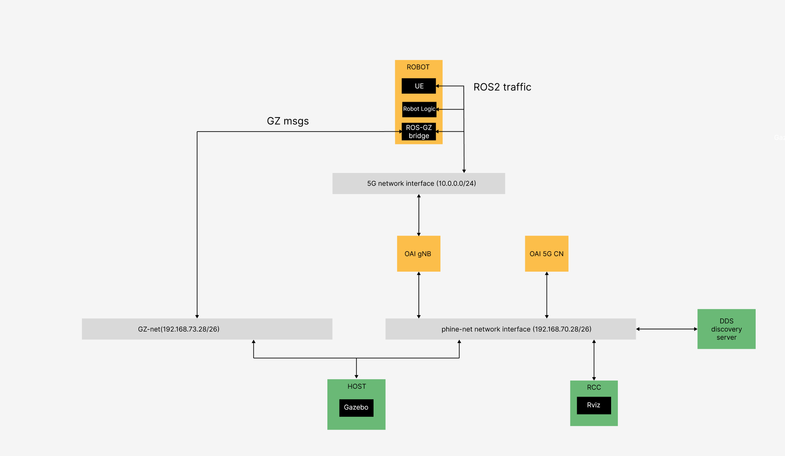

## gNB and UE Gazebo Plugins

This repository contains the model and the plugins, developed by phine.tech, to simulate the behaviour of a gNB and a UE in Gazebo Ignition. The underlying 5G component are docker containers developed by Open Air Interface(OAI), that have been exploited by phine.tech to make accessible these advance networking modules to the robotic community. The aim is that a roboticist who is not an expert in 5G connectivity can easily simulate its robotic applications in a 5G end-to-end network without knowing the technical details on which the OAI Framework is built on.

The table of content of this README file is:

1. [Release Versions](#release-versions)

2. [OAI setup](#oai-setup)

3. [Phine.tech gNodeB](#-phinetech-gnodeb-plugin)

	- [Visualization](#%EF%B8%8F-visualization)
	
	- [gNB plugin](#-gnb-plugin)
	
	- [gNB World file declaration](#-gnb-world-file-declaration)

4. [Phine.tech UE](#-phinetech-ue-plugin)

	- [UE plugin](#-ue-plugin)
	
	- [UE World file declaration](#-ue-world-file-declaration)

5. [Modifying the source code](#modify-gnb-source-code)

6. [Upcoming features](#upcoming-features)


If something goes wrong in following this README file or you have any questions, you can write on our [slack chat](https://join.slack.com/t/robosimworkspace/shared_invite/zt-38i7sbsit-FpsT6d7PU241~nGz0fcUig).

## Requirements

The project has been tested with:

- Ubuntu 22.04

- ROS2 humble

- Docker version 27.5.1, build 9f9e405

- docker-compose version 1.29.2

- gazebo ignition fortress 2.6.9

## OAI setup

Considering `path` the absolute path to the repository, the OAI files can be found in `path/demo/oai_setup`. Inside this folder there are 3 docker-compose file:

- docker-compose.yml for launching the OAI Core Network containers

- docker-compose-gNB.yml for launching the OAI gNB container

- docker-compose-ue.yml for launching the OAI UE container (and also other containers related to the demo)

Other folders are present inside `oai-setup`, containing configuration files useful for these containers. It is possible to verify that the OAI modules work, by following this pipeline:

- In one terminal run the core network:

```

cd path/demo/oai_setup

docker compose up -d

```

In the same terminal (wait 5-10 seconds):

```

docker logs oai-udr

```

If everything went correctly, in the logs you should see:

```

[2025-02-28 13:01:58.215] [udr_app] [debug] Instance name: OAI-UDR

[2025-02-28 13:01:58.215] [udr_app] [debug] Instance type: UDR

[2025-02-28 13:01:58.215] [udr_app] [debug] Instance fqdn:

[2025-02-28 13:01:58.215] [udr_app] [debug] Status: REGISTERED

[2025-02-28 13:01:58.215] [udr_app] [debug] HeartBeat timer: 50

[2025-02-28 13:01:58.215] [udr_app] [debug] Priority: 1

[2025-02-28 13:01:58.215] [udr_app] [debug] Capacity: 100

[2025-02-28 13:01:58.215] [udr_app] [debug] IPv4 Addr:

[2025-02-28 13:01:58.215] [udr_app] [debug] 192.168.70.136

[2025-02-28 13:01:58.215] [udr_app] [debug] UDR Info

[2025-02-28 13:01:58.215] [udr_app] [debug] GroupId: oai-udr-testgroupid

[2025-02-28 13:01:58.215] [udr_app] [debug] SupiRanges: Start - 208950000000131, End - , Pattern - ^imsi-20895[31-131]{6}$

[2025-02-28 13:01:58.215] [udr_app] [debug] GpsiRanges: Start - 752740000, End - 752749999, Pattern - ^gpsi-75274[0-9]{4}$

[2025-02-28 13:01:58.215] [udr_app] [debug] Data Set Id: 0210

[2025-02-28 13:01:58.215] [udr_app] [debug] Data Set Id: 9876

  

```

- in the same terminal run the gNB container:

```bash

docker compose -f docker-compose-ran.yml up -d

```

In the same terminal (wait 5-10 seconds):

```bash

docker logs oai-amf

```

If everything goes well you should see in the logs a table with the list of the connected gNBs and their names (in this case one named gnb-rfsim):

```

|------------------------------gNBs' Information-------------------------|

| Index | gNB Name | Status | PLMN | Global Id |

| 1 | gnb-rfsim | Connected | 001,01 | 0x0E00 |

-------------------------------------------------------------------------------

```

- in the same terminal run the UE container :

```bash

docker compose -f docker-compose-ue.yml up oai-nr-ue -d

```

In the same terminal(wait 5-10 seconds):

```bash

docker logs oai-amf

```

in the logs you will see if it is working:

```

|----------------------UEs' Information-----------------------------------------|
   |  Index |     5GMM State     |        IMSI        |        GUTI        | 
     
   |    1   |   5GMM-REGISTERED  |   001010000000101  |00101010041631377652|
   
   RAN UE NGAP ID   |   AMF UE NGAP ID   |        PLMN        |       Cell Id       
  0x01        |        0x01        |       001,01       |      000000100     |
   |----------------------------------------------------------------------------|
```

To stop and remove all the containers:

```bash

docker compose -f docker-compose-gNB.yml down

docker compose -f docker-compose-ue.yml down

docker compose down -d


```

## 📡 Phine.tech gNodeB Plugin

This plugin allows rapid deployment and configuration of a **5G gNodeB (gNB)** directly from a Gazebo SDF world file. It is designed to be attached to a simple visual model representing a 5G cell and provides dynamic runtime behavior and container-based backend automation.

---

### 🖼️ Visualization

The gNB is visually represented in Gazebo as a **white, thin box**, resembling a 5G antenna.  
The model can be found at:
```bash
path/model_folder/phine_gNB/model.sdf
```
**Note:** Gravity is **disabled** for this model to make its placement easier in the world.

---

## 🔌 gNB Plugin

### 📁 Source Code

- Source location:  
    `path/phine-gz-ros/src/phine_plugins/src`
    
- Prebuilt plugin library:  
    `path/phine-gz-ros/build/phine_plugins/libgNB-plugin.so`
    

### 🔨 Building the Plugin (after modifications)

If you modify the source code, rebuild the plugin using:
```sh
cd path/phine-plugins && colcon build
```

_Some warning messages may appear during the build — they can usually be ignored unless they block functionality._

---

### ⚙️ Plugin Behavior

#### At **Load Time**, the plugin:

- Modifies configuration files for the gNB container:
    
    - `docker-compose-gNB.yml`
        
    - `gnb.sa.bandn78.fr1.106PRB.rfsim.conf`
        
    
    Changes include:
    
    - Docker network name
        
    - gNB IP address
        
    - AMF IP address
        
- Launches the gNB container
    
- Optionally sends debug information
    

#### At **Runtime**, the plugin:

- Publishes the pose of the gNB to a ROS 2 topic called `/pose_of_<name_of_gNB>`

---

## 🌍 SDF World File Declaration

### 🔧 Required Environment Variables

Before launching the world, make sure the following environment variables are exported:

```bash
export PROJECT_PATH=<your-project-path>  # Must contain oai_setup/ 
export IGN_GAZEBO_SYSTEM_PLUGIN_PATH=<path-to-plugins>  # Contains libgNB-plugin.so
export IGN_GAZEBO_RESOURCE_PATH=<path-to-models>  # Contains phine_gNB model`
```
### 📝 gNB World File Declaration

Add the following to your `world-file.sdf` to include the gNB:
```xml

<include>

  

<uri>model://phine_gNB</uri>

<name>gNB1</name>

<pose>0 0 1 0 0 0</pose>

<plugin name="phine_plugins::gNB_plugin" filename="gNB_plugin">

<link_name>phine_cell</link_name>

<net_name>phine-net</net_name>

<IP_GNB>192.168.70.159</IP_GNB>

<IP_AMF>192.168.70.132</IP_AMF>

<debug>false</debug>

<mobile_country_code>001</mobile_country_code>

<mobile_network_code>01</mobile_network_code>

</plugin>

  

</include>

```


---

## 🔧 Configurable Parameters

| **Parameter**         | **Description**                                                                                  |
| --------------------- | ------------------------------------------------------------------------------------------------ |
| `name`                | Name of the gNB instance (e.g., `gNB1`, `gNB2`, ...)  <br>⚠️ **Must follow the `gNB<N>` format** |
| `pose`                | Pose of the gNB in the world (x y z roll pitch yaw)                                              |
| `link_name`           | Link whose pose is streamed over ROS 2 (keep as `phine_cell` unless model changes)               |
| `net_name`            | Name of the Docker network to attach the gNB container                                           |
| `IP_GNB`              | Static IP address of the gNB container                                                           |
| `IP_AMF`              | IP address of the AMF container  <br>(Must match value in `oai_setup/conf/config.yaml`)          |
| `debug`               | Set to `true` to enable plugin debug output                                                      |
| `mobile_country_code` | MCC used for registration, must match value in AMF config                                        |
| `mobile_network_code` | MNC used for registration, must match value in AMF config                                        |

---

## 📱 Phine.tech UE plugin

The idea is that, after declaring this plugin inside an SDF Gazebo world, the plugin launches a **robot-UE container** that contains both your robot logic and a **UE process**. This UE process continuously runs to emulate the presence of a 5G modem in your robot.

You will need to define the path to the **launch file** for your robot logic (such as its navigation stack), configure the 5G parameters, and the UE plugin will build the image and launch the container.

However, this plugin is tightly coupled to the system architecture designed by **phine.tech**, and it assumes the following structure:


---

### **Key Architecture Components**

- **robot-UE container**:  
    Launched by the UE plugin. It runs:
    
    - The 5G UE process (continuously running)
        
    - The robot logic (launch file provided by the user)
        
    - The `ros_gz_bridge` (launch file provided by the user)
        
- **Remote Control Center (RCC) container**:  
    Sends desired positions to the robot.
    
- **Gazebo world**:  
	    Launched on the host machine. You must include the UE and gNB plugin definitions and models in the world file.
    
- **DDS Discovery Server**:  
    Required to enable ROS 2 discovery over the 5G network.  
    The robot-UE container must be able to route to the DDS server.  
    The **IP and port** of the DDS server are specified in the plugin configuration.
    
- **5G Core Network**:  
    Provided by **OAI** (OpenAirInterface).
    

---

#### **Recommended ROS 2 Workspace Structure**

To replicate this architecture, it is essential to divide your ROS 2 workspace logically. Robotics projects often use a single monolithic launch file, but in this case, it should be divided in:

1. **Gazebo World Workspace**
    
    - Launches the simulation world.
        
    - Includes:
        
        - World file
            
        - UE and gNB models
            
        - Plugin declarations
            
2. **Robot Workspace**
    
    - Includes two specific launch files used by the UE plugin:
        
        - **Robot logic launch file**: e.g., navigation, SLAM
            
        - **ros_gz_bridge launch file**: for ROS <-> Gazebo communication
            
3. **Remote Control Workspace**
    
    - Sends goal positions to the robot
        
    - Typically includes:
        
        - RViz launch file
            
        - RViz configuration file
        
A good reference is  `path/demo/nav_stack` folder that will be copied inside the robot-UE container for the demo.        

---

#### **Network Architecture**

The system relies on three main networks:

- **`public_net`**
    
    - Bridges all 5G network functions
        
    - Name and subnet can be customized
        
    - Must be referenced in the plugin configuration
        
- **`ros_gz_net`**
    
    - Mimics the physical layer between the robot PC and actuators
        
    - Directly connects the **Gazebo host** with the **robot-UE container**
        
    - **Static IP**: The robot container must always use `192.168.73.150`
        
    - The **subnet cannot be changed**
        
- **5G network**
    
    - Used for communication between the remote control center and the robot
        
    - Subnet is configurable in `path/demo/oai-setuo/conf/config.yaml`
### 🔌 UE plugin

#### ✅ UE Plugin Behavior at Load Time

When the plugin is loaded, it performs the following steps:

- **Modifies configuration files for the UE** in `$PROJECT_PATH/oai_setup`, specifically:
    
    - `docker-compose-UE.yml`
        
    - `conf/UE<robot_ID>.conf`
- **Copies the user robot workspace** inside the `$PROJECT_PATH/images/ue_amr` folder, which should contain:

	- robot logic launch file
	
	- ros_gz_bridge launch file
- **Builds the `ue-amr` Docker image**, which contains:
    
    - A continuously running 5G UE process
        
    - The robot logic (user-defined launch file)
        
    - The `ros_gz_bridge`
        
- **Launches the robot-UE container**, using the `robot_<robot_ID>` service defined in `$PROJECT_PATH/oai_setup/docker-compose-ue.yml`  
    _(Currently, only `<robot_ID>=1` is tested.)_
    
- **Automatically launches the ROS-Gazebo bridge** inside the container
    
- **Automatically launches the robot logic**, unless this feature is disabled via the `execute_robot_launch_file` option in the plugin SDF
    
- **Sends debug information**, if requested
    

---

#### ✅ Required Environment Variables on the Host

Set the following environment variables on the host system:

```sh
export PROJECT_PATH=<your-project-path>  # Must contain oai_setup/
export IGN_GAZEBO_SYSTEM_PLUGIN_PATH=<path-to-plugins> # Contains libUE-plugin.so and libgNB-plugin.so
export IGN_GAZEBO_RESOURCE_PATH=<path-to-models>  # Contains phine-gNB model
export ROS_DOMAIN_ID=<your-ros2-domain-id>  # Shared by host and robot-UE container
export IGN_PARTITION=<your-ign-partition>  # Shared by host and robot-UE container
export IGN_TRANSPORT_INTERFACE=192.168.73.129 # Used for direct Gazebo <-> robot-UE link`
```
You also **must add a route to the 5G network** via the UPF (User Plane Function) node, using:

```sh
sudo ip route add <5G_subnet> via <ip_upf> dev <public_net_interface>
```
This command ensures that traffic destined for the 5G subnet is routed correctly to the robot.

---

#### ✅ ROS 2 Launch Integration

If you are launching your Gazebo world via a ROS 2 launch file:

- Include the `phine-gNB` model from `path/model_folder/phine_gNB` and make sure the path is listed in `IGN_GAZEBO_RESOURCE_PATH`.
    
- Add the following plugin to your `IGN_GAZEBO_SYSTEM_PLUGIN_PATH`:
    
    - `path/phine-gz-ros/build/phine_plugins/libUE-plugin.so`
        
    - `path/phine-gz-ros/build/phine_plugins/libgNB-plugin.so`
        

---

#### ⚠️ Known Gazebo Limitation

When loading a complex world with physical models **and** the UE plugin, Gazebo may fail to open.  
**Workaround**:  
Create a single composite model that includes all the physical objects in the world, and declare all plugins at the world level.  
Refer to `path/demo/gazebo_launch` for an example.

---

#### ✅ Required Folder Structure and Images

- The plugin expects the folder:  
    `$PROJECT_PATH/oai_setup/images/ue_amr`  
    It must contain the files from:  
    `path/demo/oai_setup/images/ue_amr`
    
- This directory must contain a `Dockerfile` used to build the `ue_amr` image.  
    You can **customize the Dockerfile** to install additional robot dependencies or ROS packages.
    
- The folder `$PROJECT_PATH/oai_setup` must also contain:
    
    - All configuration files for the 5G OAI components
        
    - Compose files to launch the core network, gNB, and UE(s)
        
    
    Specifically, the plugin will launch the **`robot_<robot_ID>` service** defined in:  
    `$PROJECT_PATH/oai_setup/docker-compose-ue.yml`
    
    You may extend `docker-compose-ue.yml` to include services for:
    
    - The **DDS Discovery Server**
        
    - The **Remote Controller** (e.g., RViz node for navigation goals)  
        _It’s recommended to reuse the demo service definitions._
        
- The **robot container must join two networks**:
    
    - `public_net`
        
    - `ros_gz_net` — with **static IP `192.168.73.150`** (this IP **must not change**)
        

---

#### 🛠️ Plugin Source Code and Rebuilding

- UE plugin source code is located in:  
    `path/phine-plugins/src/phine_plugins/src`
    
- The compiled `.so` is already available at:  
    `path/phine-gz-ros/build/phine_plugins/libUE-plugin.so`
    
- If you modify the plugin source code, rebuild the `phine_plugins` ROS 2 package:
    

```bash
cd path/phine-plugins colcon build
```
_Some warning messages may appear — these can usually be ignored unless they affect functionality._
### 📝 UE World File Declaration

The majority of parameters for the **UE plugin** are tailored to the framework demonstrated in the provided `path/demo`. If you plan to adapt this plugin for your own application, you should first understand the structure and logic of the demo, and maintain a similar organization in your project.

#### 💡 Example SDF Plugin Block

To add the UE plugin to your SDF world file, include:
```xml
<plugin name="phine_plugins::UE_plugin" filename="UE_plugin">
	<robot_container_name>ue_turtlebot</robot_container_name>
	<robot_id>1</robot_id>   
	<ip_robotUE>192.168.70.150</ip_robotUE>
	<net_name>phine-net</net_name>
	<ip_gnb>192.168.70.160</ip_gnb>
	<debug>true</debug>
	<subnet_5G>10.0.0.0/28</subnet_5G>
	<imsi>001010000000101</imsi>
	<key>fec86ba6eb707ed08905757b1bb44b8f</key> 
	<opc>C42449363BBAD02B66D16BC975D77CC1</opc>
	<dnn>oai</dnn>
	<nssai_sst>1</nssai_sst>
	<nssai_sd>no</nssai_sd>
	<robot_project_path>${PROJECT_PATH}/nav_stack</robot_project_path>
	<robot_project_name>nav_stack</robot_project_name>
	<execute_robot_launch_file>true</execute_robot_launch_file>
	<robot_package_name>ign_turtlebot</robot_package_name>
	<ros_gz_bridge_name>ros_gz_bridge.launch.py</ros_gz_bridge_name>     
	<robot_launch_file_name>nav_stack.launch.py</robot_launch_file_name> 
	<ros_discovery_server>192.168.70.159:11811</ros_discovery_server>
</plugin>
```
---

## 🔧 Plugin Parameters — Description

| **Parameter**               | **Description**                                                             |
| --------------------------- | --------------------------------------------------------------------------- |
| `robot_container_name`      | Name of the UE container to be launched (e.g., `ue_turtlebot`)              |
| `robot_id`                  | Unique ID for the robot, used to select `UE<robot_id>.conf`                 |
| `ip_robotUE`                | Static IP assigned to the robot UE container                                |
| `net_name`                  | Name of the Docker network to attach the UE container                       |
| `ip_gnb`                    | IP address of the gNB container                                             |
| `debug`                     | If `true`, plugin will print debug logs                                     |
| `subnet_5G`                 | Subnet of the 5G network (must match core config, e.g., `10.0.0.0/28`)      |
| `imsi`                      | Unique identifier for the UE (matches entry in core network config)         |
| `key`                       | 128-bit cryptographic key shared with 5G core for authentication            |
| `opc`                       | Operator-specific key used in authentication                                |
| `dnn`                       | Data network name (e.g., `oai`, `internet`, `ims`)                          |
| `nssai_sst`                 | Network slice type (e.g., `1` for eMBB, URLLC, etc.)                        |
| `nssai_sd`                  | Slice differentiator. If set to `no`, it will not be assigned               |
| `robot_project_path`        | Path to the ROS 2 workspace with robot logic                                |
| `robot_project_name`        | Name of the ROS 2 workspace with robot logic                                |
| `execute_robot_launch_file` | Whether to launch robot logic inside the container (`true` or `false`)      |
| `robot_package_name`        | ROS 2 package name containing the robot's launch files                      |
| `ros_gz_bridge_name`        | Name of the launch file for the ROS-Gazebo bridge                           |
| `robot_launch_file_name`    | ROS 2 launch file for robot logic (e.g., navigation)                        |
| `ros_discovery_server`      | IP and port of the Fast DDS discovery server (e.g., `192.168.70.159:11811`) |

---

### ⚠️ Notes

- Files such as `UE<robot_id>.conf` should be located in:  
    `path/demo/oai_setup/conf/UE<robot_id>.conf`
    
- All credentials (`imsi`, `key`, `opc`, `dnn`, `nssai_sst`, `nssai_sd`) **must match** the configuration of the 5G core network.
    
- If `nssai_sd` is set to `"no"`, the `nssai_sd` won't be assigned .
    
- The `<subnet_5G>` must match the value defined in the core network's configuration file:
 ```sh
    path/demo/oai_setup/conf/config.yaml
```
    
- Be sure to follow the same network and workspace structure as the demo for compatibility.

## Modify source code

The source code of the plugins is at `path/phine-plugins/src/phine_plugins/src`. You can modify it as you wish consulting [Coding Guidelines](CODE_OF_CONDUCT.md) and [Contributing](CONTRIBUTING.md) and in case you would like to share your work. Once you have modified the code, delete `path/phine-plugins/log`,`path/phine-plugins/install`,`path/phine-plugins/build` and run in `path/phine-plugins`(with `path` the path to main folder of the repo):

```
colcon build
```

The updated plugins will be in `path/phine-plugins/build`.

## Upcoming features

- re-organization and source code of power buttons for UE and gNB 
