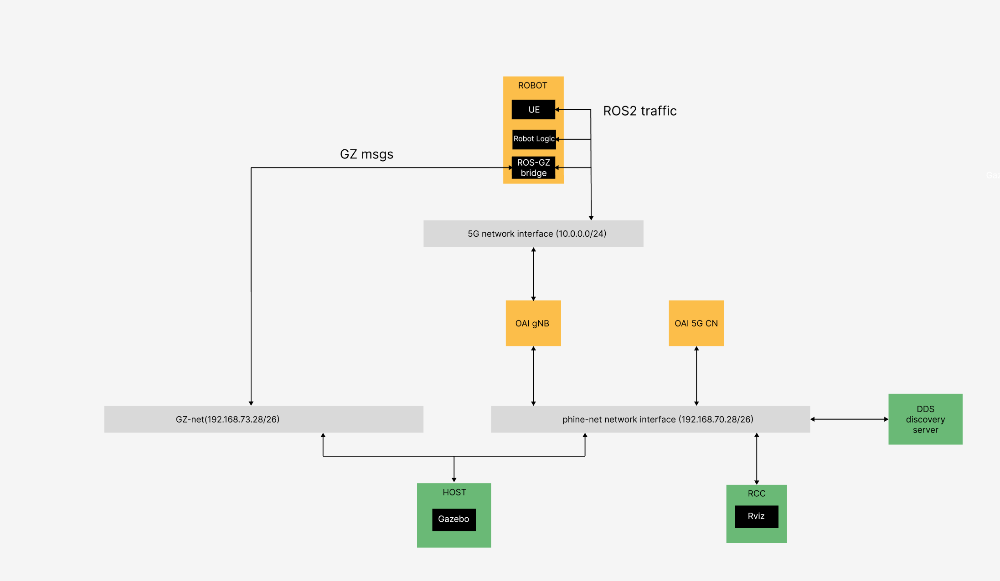

## gNB and UE Gazebo Plugins


There are **two demo modes** provided in this repository:

- **demo_containerized/**: Runs the entire simulation—including Gazebo—inside Docker containers. This is ideal for users who want a fully containerized, reproducible environment with minimal local setup.
- **demo/**: Runs Gazebo directly on the local machine, while the 5G Core Network and related services are still containerized. This mode is suitable for users who want to leverage their local Gazebo installation for better performance or direct GUI access.

Both demos support all three 5G Core Network options (OAI, free5GC, Open5GS). Choose the mode that best fits your workflow and system configuration.

This repository contains the model and the plugins, developed by phine.tech, to simulate the behaviour of a gNB and a UE in Gazebo Ignition. The plugins are compatible with **three 5G Core Network implementations** (OAI, free5GC, and Open5GS), all deployed as docker containers, making advanced 5G networking accessible to the robotic community. The aim is that a roboticist who is not an expert in 5G connectivity can easily simulate their robotic applications in a 5G end-to-end network without knowing the underlying technical details. Throughout this documentation, **OAI (Open Air Interface) is used as an example**, but the same concepts apply to all supported core networks.

The table of content of this README file is:

1. [Release Versions](#release-versions)

2. [5G Core Network Options](#5g-core-network-options)

3. [Core Network Setup (Example: OAI)](#core-network-setup-example-oai)

4. [Phine.tech gNodeB](#-phinetech-gnodeb-plugin)

	- [Visualization](#%EF%B8%8F-visualization)
	
	- [gNB plugin](#-gnb-plugin)
	
	- [gNB World file declaration](#-gnb-world-file-declaration)

4. [Phine.tech UE](#-phinetech-ue-plugin)

	- [UE plugin](#-ue-plugin)
	
	- [UE World file declaration](#-ue-world-file-declaration)

5. [Network Monitor Plugin](#-network-monitor-plugin)

	- [Why monitor the network in a ROS 2 5G simulation](#-why-monitor-the-network-in-a-ros-2-5g-simulation)

	- [Plugin behavior](#-plugin-behavior)

	- [Usage](#-usage)

	- [Configuration parameters](#-configuration-parameters)

6. [gNB Power and UE Power Control Plugins](#-gnb-power-and-ue-power-control-plugins)

	- [What they do](#-what-they-do)

	- [How they work](#-how-they-work)

	- [Usage](#-usage-1)

	- [Configuration parameters](#-configuration-parameters-1)

7. [Modifying the source code](#modify-gnb-source-code)


If something goes wrong in following this README file or you have any questions, you can write on our [slack chat](https://join.slack.com/t/robosimworkspace/shared_invite/zt-38i7sbsit-FpsT6d7PU241~nGz0fcUig).

## Requirements

The project has been tested with:

- Ubuntu 22.04

- ROS2 humble

- Docker version 27.5.1, build 9f9e405

- Docker Compose version v2.33.1

- gazebo ignition fortress 2.6.9

## 5G Core Network Options

RoboSim5G supports **multiple 5G Core Network implementations**. You can choose the one that best fits your needs:

- **OAI (OpenAirInterface)** - High-performance, research-focused implementation
- **free5GC** - User-friendly with comprehensive WebUI for subscriber management  
- **Open5GS**  - Mature implementation with excellent documentation

📖 **See [doc/5G_CORE_NETWORKS.md](doc/5G_CORE_NETWORKS.md) for a detailed comparison and guidance on choosing the right core network.**

Each core network has its own README with setup instructions in the respective `demo/<cn_name>_setup/` folder.

## Core Network Setup (Example: OAI)

The following example uses **OAI**, but similar steps apply to other core networks. Refer to the specific README for each:
- **OAI**: `demo/oai_setup/README.md`
- **free5GC**: `demo/free5gc_setup/README.md`
- **Open5GS**: `demo/open5gs_setup/README.md` *(coming soon)*

Considering `path` the absolute path to the repository, the OAI files can be found in `path/demo/oai_setup`. Inside this folder there are 3 docker-compose file:

- docker-compose.yml for launching the OAI Core Network containers

- docker-compose-gNB.yml for launching the OAI gNB container

- docker-compose-ue.yml for launching the OAI UE container (and also other containers related to the demo)

Other folders are present inside `oai-setup`, containing configuration files useful for these containers. It is possible to verify that the OAI modules work, by following this pipeline:

- In one terminal run the core network:

```

cd path/demo/oai_setup

docker compose up -d

```

In the same terminal (wait 5-10 seconds):

```

docker logs oai-udr

```

If everything went correctly, in the logs you should see:

```

[2025-02-28 13:01:58.215] [udr_app] [debug] Instance name: OAI-UDR

[2025-02-28 13:01:58.215] [udr_app] [debug] Instance type: UDR

[2025-02-28 13:01:58.215] [udr_app] [debug] Instance fqdn:

[2025-02-28 13:01:58.215] [udr_app] [debug] Status: REGISTERED

[2025-02-28 13:01:58.215] [udr_app] [debug] HeartBeat timer: 50

[2025-02-28 13:01:58.215] [udr_app] [debug] Priority: 1

[2025-02-28 13:01:58.215] [udr_app] [debug] Capacity: 100

[2025-02-28 13:01:58.215] [udr_app] [debug] IPv4 Addr:

[2025-02-28 13:01:58.215] [udr_app] [debug] 192.168.70.136

[2025-02-28 13:01:58.215] [udr_app] [debug] UDR Info

[2025-02-28 13:01:58.215] [udr_app] [debug] GroupId: oai-udr-testgroupid

[2025-02-28 13:01:58.215] [udr_app] [debug] SupiRanges: Start - 208950000000131, End - , Pattern - ^imsi-20895[31-131]{6}$

[2025-02-28 13:01:58.215] [udr_app] [debug] GpsiRanges: Start - 752740000, End - 752749999, Pattern - ^gpsi-75274[0-9]{4}$

[2025-02-28 13:01:58.215] [udr_app] [debug] Data Set Id: 0210

[2025-02-28 13:01:58.215] [udr_app] [debug] Data Set Id: 9876

  

```

- in the same terminal run the gNB container:

```bash

docker compose -f docker-compose-ran.yml up -d

```

In the same terminal (wait 5-10 seconds):

```bash

docker logs oai-amf

```

If everything goes well you should see in the logs a table with the list of the connected gNBs and their names (in this case one named gnb-rfsim):

```

|------------------------------gNBs' Information-------------------------|

| Index | gNB Name | Status | PLMN | Global Id |

| 1 | gnb-rfsim | Connected | 001,01 | 0x0E00 |

-------------------------------------------------------------------------------

```

- in the same terminal run the UE container :

```bash

docker compose -f docker-compose-ue.yml up oai-nr-ue -d

```

In the same terminal(wait 5-10 seconds):

```bash

docker logs oai-amf

```

in the logs you will see if it is working:

```

|----------------------UEs' Information-----------------------------------------|
   |  Index |     5GMM State     |        IMSI        |        GUTI        | 
     
   |    1   |   5GMM-REGISTERED  |   001010000000101  |00101010041631377652|
   
   RAN UE NGAP ID   |   AMF UE NGAP ID   |        PLMN        |       Cell Id       
  0x01        |        0x01        |       001,01       |      000000100     |
   |----------------------------------------------------------------------------|
```

To stop and remove all the containers:

```bash

docker compose -f docker-compose-gNB.yml down

docker compose -f docker-compose-ue.yml down

docker compose down -d


```

## 📡 Phine.tech gNodeB Plugin

This plugin allows rapid deployment and configuration of a **5G gNodeB (gNB)** directly from a Gazebo SDF world file. It is designed to be attached to a simple visual model representing a 5G cell and provides dynamic runtime behavior and container-based backend automation.

---

### 🖼️ Visualization

The gNB is visually represented in Gazebo as a **white, thin box**, resembling a 5G antenna.  
The model can be found at:
```bash
path/model_folder/phine_gNB/model.sdf
```
**Note:** Gravity is **disabled** for this model to make its placement easier in the world.

---

## 🔌 gNB Plugin

### 📁 Source Code

- Source location:  
    `path/phine-gz-ros/src/phine_plugins/src`
    
- Prebuilt plugin library:  
    `path/phine-gz-ros/build/phine_plugins/libgNB-plugin.so`
    

### 🔨 Building the Plugin (after modifications)

If you modify the source code, rebuild the plugin using:
```sh
cd path/phine-plugins && colcon build
```

_Some warning messages may appear during the build — they can usually be ignored unless they block functionality._

---

### ⚙️ Plugin Behavior

#### At **Load Time**, the plugin:

- Modifies configuration files for the gNB container:
    
    - `docker-compose-gNB.yml`
        
    - `gnb.sa.bandn78.fr1.106PRB.rfsim.conf`
        
    
    Changes include:
    
    - Docker network name
        
    - gNB IP address
        
    - AMF IP address
        
- Launches the gNB container
    
- Optionally sends debug information
    

#### At **Runtime**, the plugin:

- Publishes the pose of the gNB to a ROS 2 topic called `/pose_of_<name_of_gNB>`

---

## 🌍 SDF World File Declaration

### 🔧 Required Environment Variables

Before launching the world, make sure the following environment variables are exported:

```bash
export PROJECT_PATH=<your-project-path>  # Must contain oai_setup/ 
export IGN_GAZEBO_SYSTEM_PLUGIN_PATH=<path-to-plugins>  # Contains libgNB-plugin.so
export IGN_GAZEBO_RESOURCE_PATH=<path-to-models>  # Contains phine_gNB model`
```
### 📝 gNB World File Declaration

Add the following to your `world-file.sdf` to include the gNB:
```xml
<include>
  <uri>model://phine_gNB</uri>
  <name>gNB1</name>
  <pose>0 0 1 0 0 0</pose>
  <plugin name="phine_plugins::gNB_plugin" filename="gNB_plugin">
    <cn_type>oai</cn_type>  <!-- Options: oai, free5gc, open5gs -->
    <link_name>phine_cell</link_name>
    <net_name>phine-net</net_name>
    <IP_GNB>192.168.70.159</IP_GNB>
    <IP_AMF>192.168.70.132</IP_AMF>
    <debug>false</debug>
    <mobile_country_code>001</mobile_country_code>
    <mobile_network_code>01</mobile_network_code>
  </plugin>
</include>
```


---

## 🔧 Configurable Parameters

| **Parameter**         | **Description**                                                                                  |
| --------------------- | ------------------------------------------------------------------------------------------------ |
| `cn_type`             | Core Network type (`oai`, `free5gc`, or `open5gs`)                                               |
| `name`                | Name of the gNB instance (e.g., `gNB1`, `gNB2`, ...)  <br>⚠️ **Must follow the `gNB<N>` format** |
| `pose`                | Pose of the gNB in the world (x y z roll pitch yaw)                                              |
| `link_name`           | Link whose pose is streamed over ROS 2 (keep as `phine_cell` unless model changes)               |
| `net_name`            | Name of the Docker network to attach the gNB container                                           |
| `IP_GNB`              | Static IP address of the gNB container                                                           |
| `IP_AMF`              | IP address of the AMF container  <br>(Must match value in `oai_setup/conf/config.yaml`)          |
| `debug`               | Set to `true` to enable plugin debug output                                                      |
| `mobile_country_code` | MCC used for registration, must match value in AMF config                                        |
| `mobile_network_code` | MNC used for registration, must match value in AMF config                                        |

---

## 📱 Phine.tech UE plugin

The idea is that, after declaring this plugin inside an SDF Gazebo world, the plugin launches a **robot-UE container** that contains both your robot logic and a **UE process**. This UE process continuously runs to emulate the presence of a 5G modem in your robot.

You will need to define the path to the **launch file** for your robot logic (such as its navigation stack), configure the 5G parameters, and the UE plugin will build the image and launch the container.

However, this plugin is tightly coupled to the system architecture designed by **phine.tech**, and it assumes the following structure:


---

### **Key Architecture Components**

- **robot-UE container**:  
    Launched by the UE plugin. It runs:
    
    - The 5G UE process (continuously running)
        
    - The robot logic (launch file provided by the user)
        
    - The `ros_gz_bridge` (launch file provided by the user)
        
- **Remote Control Center (RCC) container**:  
    Sends desired positions to the robot.
    
- **Gazebo world**:  
	    Launched on the host machine. You must include the UE and gNB plugin definitions and models in the world file.
    
- **DDS Discovery Server**:  
    Required to enable ROS 2 discovery over the 5G network.  
    The robot-UE container must be able to route to the DDS server.  
    The **IP and port** of the DDS server are specified in the plugin configuration.
    
- **5G Core Network**:  
    Provided by **OAI** (OpenAirInterface).
    

---

#### **Recommended ROS 2 Workspace Structure**

To replicate this architecture, it is essential to divide your ROS 2 workspace logically. Robotics projects often use a single monolithic launch file, but in this case, it should be divided in:

1. **Gazebo World Workspace**
    
    - Launches the simulation world.
        
    - Includes:
        
        - World file
            
        - UE and gNB models
            
        - Plugin declarations
            
2. **Robot Workspace**
    
    - Includes two specific launch files used by the UE plugin:
        
        - **Robot logic launch file**: e.g., navigation, SLAM
            
        - **ros_gz_bridge launch file**: for ROS <-> Gazebo communication
            
3. **Remote Control Workspace**
    
    - Sends goal positions to the robot
        
    - Typically includes:
        
        - RViz launch file
            
        - RViz configuration file

        - routing trough upf or ext-dn to reach the UE (`ip route add <ue_ip_range> via <upf/ext_dn_ip> dev <interface>`)

4. **Discovery server**
    
    - enable unicast communication(multicast not available in majority of CN)

    - needs routing trough upf or ext-dn to reach the UE (`ip route add <ue_ip_range> via <upf/ext_dn_ip> dev <interface>`)

        
A good reference is  `path/demo/nav_stack` folder that will be copied inside the robot-UE container for the demo. 

Routing through the upf is necessary for any container in the Data network(outside 5G network).

---

#### **Network Architecture**

The system relies on three main networks:

- **`public_net`**
    
    - Bridges all 5G network functions
        
    - Name and subnet can be customized
        
    - Must be referenced in the plugin configuration
        
- **`ros_gz_net`**
    
    - Mimics the physical layer between the robot PC and actuators
        
    - Directly connects the **Gazebo host** with the **robot-UE container**
        
    - **Static IP**: The robot container must always use `192.168.73.150`
        
    - The **subnet cannot be changed**
        
- **5G network**
    
    - Used for communication between the remote control center and the robot
        
    - Subnet is configurable in `path/demo/oai-setuo/conf/config.yaml`

---

#### **DDS Profiles Configuration**

ROS 2 communication over 5G networks requires careful DDS (Data Distribution Service) configuration. The architecture uses **Fast DDS profiles** to control network transport behavior and enable proper discovery across the distributed system.

##### **Why DDS Profiles Are Needed**

- **Multicast not available**: Most 5G Core Networks do not support multicast traffic, requiring **unicast-only** communication
- **Interface selection**: The UE must communicate exclusively through its 5G tunnel interface, not other network interfaces
- **Fragmentation prevention**: Large ROS 2 messages must be handled properly to avoid UDP fragmentation issues
- **Discovery server**: Centralized discovery is needed since multicast discovery won't work over 5G

##### **UE Container DDS Profile**

The robot-UE container uses a restrictive profile that **whitelists only the 5G tunnel interface** (e.g., `10.0.0.x` addresses). This ensures all ROS 2 traffic goes through the 5G network.

**Key configuration** (example from `path/demo/images/ue_amr/dds.xml`):

```xml
<transport_descriptor>
    <transport_id>UDP_5G_Only</transport_id>
    <type>UDPv4</type>
    <maxMessageSize>1400</maxMessageSize>  <!-- Fragmentation prevention -->
    <sendBufferSize>1048576</sendBufferSize>
    <receiveBufferSize>1048576</receiveBufferSize>
    <non_blocking_send>true</non_blocking_send>
    <interfaceWhiteList>
        <address>10.0.0.1</address>
        <address>10.0.0.2</address>
        <!-- ... additional 5G tunnel addresses ... -->
    </interfaceWhiteList>
</transport_descriptor>

<participant profile_name="Participant_5G_Only" is_default_profile="true">
    <rtps>
        <userTransports>
            <transport_id>UDP_5G_Only</transport_id>
        </userTransports>
        <useBuiltinTransports>false</useBuiltinTransports>  <!-- Disable default transports -->
        <builtin>
            <avoid_builtin_multicast>true</avoid_builtin_multicast>  <!-- Force unicast -->
        </builtin>
    </rtps>
</participant>
```

**Important aspects:**
- `maxMessageSize`: Set to 1400 bytes to prevent UDP fragmentation
- `interfaceWhiteList`: Restricts communication to 5G tunnel addresses only
- `useBuiltinTransports: false`: Disables default DDS transports
- `avoid_builtin_multicast: true`: Forces unicast-only communication

##### **Data Network (RCC/Discovery Server) DDS Profile**

Nodes in the Data Network (like the Remote Control Center) use a **SUPER_CLIENT** profile to connect to the centralized **Discovery Server**.

**Key configuration** (example from `path/demo/images/rcc/dds.xml`):

```xml
<participant profile_name="participant_profile_client_full_example" is_default_profile="true">
    <rtps>
        <builtin>
            <discovery_config>
                <discoveryProtocol>CLIENT</discoveryProtocol>  <!-- Client mode -->
                <discoveryServersList>
                    <RemoteServer prefix="44.53.00.5f.45.50.52.4f.53.49.4d.41">
                        <metatrafficUnicastLocatorList>
                            <locator>
                                <udpv4>
                                    <address>192.168.70.159</address>  <!-- Discovery server IP -->
                                    <port>11811</port>                  <!-- Discovery server port -->
                                </udpv4>
                            </locator>
                        </metatrafficUnicastLocatorList>
                    </RemoteServer>
                </discoveryServersList>
            </discovery_config>
        </builtin>
    </rtps>
</participant>
```

**Important aspects:**
- `discoveryProtocol: CLIENT`: Uses centralized discovery instead of multicast
- `discoveryServersList`: Points to the Discovery Server's IP and port
- **Unicast locators**: All discovery traffic uses unicast UDP

##### **Discovery Server Configuration**

The Discovery Server itself must be configured with the `SERVER` or `SUPER_SERVER` profile and must be reachable from both:
- The UE containers (via 5G tunnel with routing through UPF)
- The Data Network containers (via `public_net`)

**Environment variable** to enable discovery server mode:
```bash
export ROS_DISCOVERY_SERVER=<discovery_server_ip>:11811
```

The Discovery Server IP must match the value in both the UE plugin `<ros_discovery_server>` parameter and the DDS profiles.

---

### 🔌 UE plugin

#### ✅ UE Plugin Behavior at Load Time

When the plugin is loaded, it performs the following steps:

- **Modifies configuration files for the UE** in `$PROJECT_PATH/oai_setup`, specifically:
    
    - `docker-compose-UE.yml`
        
    - `conf/UE<robot_ID>.conf`
- **Copies the user robot workspace** inside the `$PROJECT_PATH/images/ue_amr` folder, which should contain:

	- robot logic launch file
	
	- ros_gz_bridge launch file
- **Builds the `ue-amr` Docker image**, which contains:
    
    - A continuously running 5G UE process
        
    - The robot logic (user-defined launch file)
        
    - The `ros_gz_bridge`
        
- **Launches the robot-UE container**, using the `robot_<robot_ID>` service defined in `$PROJECT_PATH/oai_setup/docker-compose-ue.yml`  
    _(Currently, only `<robot_ID>=1` is tested.)_
    
- **Automatically launches the ROS-Gazebo bridge** inside the container
    
- **Automatically launches the robot logic**, unless this feature is disabled via the `execute_robot_launch_file` option in the plugin SDF
    
- **Sends debug information**, if requested
    

---

#### ✅ Required Environment Variables on the Host

Set the following environment variables on the host system:

```sh
export PROJECT_PATH=<your-project-path>  # Must contain oai_setup/
export IGN_GAZEBO_SYSTEM_PLUGIN_PATH=<path-to-plugins> # Contains libUE-plugin.so and libgNB-plugin.so
export IGN_GAZEBO_RESOURCE_PATH=<path-to-models>  # Contains phine-gNB model
export ROS_DOMAIN_ID=<your-ros2-domain-id>  # Shared by host and robot-UE container
export IGN_PARTITION=<your-ign-partition>  # Shared by host and robot-UE container
export IGN_TRANSPORT_INTERFACE=192.168.73.129 # Used for direct Gazebo <-> robot-UE link`
```
You also **must add a route to the 5G network** via the UPF (User Plane Function) node, using:

```sh
sudo ip route add <5G_subnet> via <ip_upf> dev <public_net_interface>
```
This command ensures that traffic destined for the 5G subnet is routed correctly to the robot.

---

#### ✅ ROS 2 Launch Integration

If you are launching your Gazebo world via a ROS 2 launch file:

- Include the `phine-gNB` model from `path/model_folder/phine_gNB` and make sure the path is listed in `IGN_GAZEBO_RESOURCE_PATH`.
    
- Add the following plugin to your `IGN_GAZEBO_SYSTEM_PLUGIN_PATH`:
    
    - `path/phine-gz-ros/build/phine_plugins/libUE-plugin.so`
        
    - `path/phine-gz-ros/build/phine_plugins/libgNB-plugin.so`
        

---

#### ⚠️ Known Gazebo Limitation

When loading a complex world with physical models **and** the UE plugin, Gazebo may fail to open.  
**Workaround**:  
Create a single composite model that includes all the physical objects in the world, and declare all plugins at the world level.  
Refer to `path/demo/gazebo_launch` for an example.

---

#### ✅ Required Folder Structure and Images

- The plugin expects the folder:  
    `$PROJECT_PATH/oai_setup/images/ue_amr`  
    It must contain the files from:  
    `path/demo/oai_setup/images/ue_amr`
    
- This directory must contain a `Dockerfile` used to build the `ue_amr` image.  
    You can **customize the Dockerfile** to install additional robot dependencies or ROS packages.
    
- The folder `$PROJECT_PATH/oai_setup` must also contain:
    
    - All configuration files for the 5G OAI components
        
    - Compose files to launch the core network, gNB, and UE(s)
        
    
    Specifically, the plugin will launch the **`robot_<robot_ID>` service** defined in:  
    `$PROJECT_PATH/oai_setup/docker-compose-ue.yml`
    
    You may extend `docker-compose-ue.yml` to include services for:
    
    - The **DDS Discovery Server**
        
    - The **Remote Controller** (e.g., RViz node for navigation goals)  
        _It’s recommended to reuse the demo service definitions._
        
- The **robot container must join two networks**:
    
    - `public_net`
        
    - `ros_gz_net` — with **static IP `192.168.73.150`** (this IP **must not change**)
        

---

#### 🛠️ Plugin Source Code and Rebuilding

- UE plugin source code is located in:  
    `path/phine-plugins/src/phine_plugins/src`
    
- The compiled `.so` is already available at:  
    `path/phine-gz-ros/build/phine_plugins/libUE-plugin.so`
    
- If you modify the plugin source code, rebuild the `phine_plugins` ROS 2 package:
    

```bash
cd path/phine-plugins colcon build
```
_Some warning messages may appear — these can usually be ignored unless they affect functionality._
### 📝 UE World File Declaration

The majority of parameters for the **UE plugin** are tailored to the framework demonstrated in the provided `path/demo`. If you plan to adapt this plugin for your own application, you should first understand the structure and logic of the demo, and maintain a similar organization in your project.

#### 💡 Example SDF Plugin Block

To add the UE plugin to your SDF world file, include:
```xml
<plugin name="phine_plugins::UE_plugin" filename="UE_plugin">
	<cn_type>oai</cn_type>  <!-- Options: oai, free5gc, open5gs -->
	<robot_container_name>ue_turtlebot</robot_container_name>
	<robot_id>1</robot_id>   
	<ip_robotUE>192.168.70.150</ip_robotUE>
	<net_name>phine-net</net_name>
	<ip_gnb>192.168.70.160</ip_gnb>
	<debug>true</debug>
	<subnet_5G>10.0.0.0/28</subnet_5G>
	<imsi>001010000000101</imsi>
	<key>fec86ba6eb707ed08905757b1bb44b8f</key> 
	<opc>C42449363BBAD02B66D16BC975D77CC1</opc>
	<dnn>oai</dnn>
	<nssai_sst>1</nssai_sst>
	<nssai_sd>no</nssai_sd>
	<robot_project_path>${PROJECT_PATH}/nav_stack</robot_project_path>
	<robot_project_name>nav_stack</robot_project_name>
	<execute_robot_launch_file>true</execute_robot_launch_file>
	<robot_package_name>ign_turtlebot</robot_package_name>
	<ros_gz_bridge_name>ros_gz_bridge.launch.py</ros_gz_bridge_name>     
	<robot_launch_file_name>nav_stack.launch.py</robot_launch_file_name> 
	<ros_discovery_server>192.168.70.159:11811</ros_discovery_server>
</plugin>
```
---

## 🔧 Plugin Parameters — Description

| **Parameter**               | **Description**                                                             |
| --------------------------- | --------------------------------------------------------------------------- |
| `cn_type`                   | Core Network type (`oai`, `free5gc`, or `open5gs`)                          |
| `robot_container_name`      | Name of the UE container to be launched (e.g., `ue_turtlebot`)              |
| `robot_id`                  | Unique ID for the robot, used to select `UE<robot_id>.conf`                 |
| `ip_robotUE`                | Static IP assigned to the robot UE container                                |
| `net_name`                  | Name of the Docker network to attach the UE container                       |
| `ip_gnb`                    | IP address of the gNB container                                             |
| `debug`                     | If `true`, plugin will print debug logs                                     |
| `subnet_5G`                 | Subnet of the 5G network (must match core config, e.g., `10.0.0.0/16`)      |
| `imsi`                      | Unique identifier for the UE (matches entry in core network config)         |
| `key`                       | 128-bit cryptographic key shared with 5G core for authentication            |
| `opc`                       | Operator-specific key used in authentication                                |
| `dnn`                       | Data network name (e.g., `oai`, `internet`, `ims`)                          |
| `nssai_sst`                 | Network slice type (e.g., `1` for eMBB, URLLC, etc.)                        |
| `nssai_sd`                  | Slice differentiator. If set to `no`, it will not be assigned               |
| `robot_project_path`        | Path to the ROS 2 workspace with robot logic                                |
| `robot_project_name`        | Name of the ROS 2 workspace with robot logic                                |
| `execute_robot_launch_file` | Whether to launch robot logic inside the container (`true` or `false`)      |
| `robot_package_name`        | ROS 2 package name containing the robot's launch files                      |
| `ros_gz_bridge_name`        | Name of the launch file for the ROS-Gazebo bridge                           |
| `robot_launch_file_name`    | ROS 2 launch file for robot logic (e.g., navigation)                        |
| `ros_discovery_server`      | IP and port of the Fast DDS discovery server (e.g., `192.168.70.159:11811`) |

---

### ⚠️ Notes

- Files such as `UE<robot_id>.conf` should be located in:  
    `path/demo/oai_setup/conf/UE<robot_id>.conf`
    
- All credentials (`imsi`, `key`, `opc`, `dnn`, `nssai_sst`, `nssai_sd`) **must match** the configuration of the 5G core network.
    
- If `nssai_sd` is set to `"no"`, the `nssai_sd` won't be assigned .
    
- The `<subnet_5G>` must match the value defined in the core network's configuration file:
 ```sh
    path/demo/oai_setup/conf/config.yaml
```
    
- Be sure to follow the same network and workspace structure as the demo for compatibility.

## 📊 Network Monitor Plugin

The **Network Monitor** is an Ignition Gazebo GUI plugin that provides real-time measurement of **latency** and **bandwidth** over the simulated 5G link between a User Equipment (UE) container and the Data Network (DN) container. It uses `ping` for latency and `iperf3` for bandwidth, executed via `docker exec` on the respective containers.

---

### 🤔 Why Monitor the Network in a ROS 2 5G Simulation

In any ROS 2 robotic application, the communication layer has a direct impact on system performance and safety. ROS 2 relies on DDS (Data Distribution Service) for all inter-node communication — including publishing sensor data, sending navigation goals, and exchanging control commands. When this communication happens over a **5G network** instead of a local Ethernet or Wi-Fi link, the characteristics of that network become a critical factor:

- **Latency affects control loops.** ROS 2 navigation stacks (e.g., Nav2) and teleoperation nodes depend on timely delivery of odometry, laser scans, and velocity commands. A latency spike over the 5G link can cause the robot to overshoot a waypoint, react late to an obstacle, or lose localization. Knowing the real-time round-trip time helps you understand whether your control loop frequency is achievable.

- **Bandwidth affects data-heavy topics.** Point clouds, camera images, and map updates are large messages. If the 5G uplink or downlink bandwidth is insufficient, DDS will drop messages or queue them, leading to stale data at the subscriber side. Monitoring bandwidth lets you verify that the 5G link can sustain the throughput your application requires.

- **5G behavior is not static.** Unlike a wired connection, a 5G link is subject to variability due to radio scheduling, handovers, and shared spectrum. Having a live monitor during simulation lets you correlate network conditions with robot behavior — for example, observing that navigation failures coincide with a bandwidth drop.

- **Validation before field deployment.** RoboSim5G is designed to let roboticists test their applications over a realistic 5G stack before deploying on physical hardware. The Network Monitor closes the loop: you can verify that the network performance meets the requirements of your ROS 2 application (e.g., < 50 ms RTT for teleoperation, > 10 Mbits/sec for video streaming) entirely within the simulation.

In short, if you are running ROS 2 topics over a 5G network, you should monitor that network — the Network Monitor plugin gives you that visibility directly inside Gazebo.

---

### ⚙️ Plugin Behavior

Once started, the plugin:

1. Launches an **iperf3 server** in daemon mode on the UE container.
2. Enters a continuous measurement loop that performs, in each cycle:
   - **Downlink latency**: `ping` from the DN container to the UE IP (1 packet, 1 s timeout).
   - **Uplink latency**: `ping` from the UE container to the DN IP (1 packet, 1 s timeout).
   - **Downlink bandwidth**: `iperf3` from the DN client to the UE server (1 s test).
   - **Uplink bandwidth**: `iperf3` in reverse mode (`-R` flag) (1 s test).
3. Updates the GUI with the latest results after each cycle.
4. When stopped, kills the iperf3 server on the UE container.

Each measurement cycle takes approximately **4 seconds**, keeping the overhead low enough to avoid slowing down the simulation.

---

### 🚀 Usage

The Network Monitor is a **GUI plugin** that can be added to your Gazebo Ignition world file or loaded at runtime from the Gazebo GUI plugin menu.

#### Adding to an SDF World File

Add the following block inside the `<gui>` section of your world file:

```xml
<gui>
  <plugin name="phine_plugins::NetworkMonitor" filename="NetworkMonitor">
    <ue_ip>10.0.0.1</ue_ip>
    <dn_ip>192.168.70.135</dn_ip>
    <ue_container_name>ue_turtlebot</ue_container_name>
    <dn_container_name>oai-ext-dn</dn_container_name>
  </plugin>
</gui>
```

All parameters are optional — they can also be set at runtime from the GUI text fields.

#### Environment Variable

The UE container name can also be set via the `UE_NAME_FOR_BUTTON` environment variable:

```bash
export UE_NAME_FOR_BUTTON=ue_turtlebot
```

If set, it overrides the default value (`ue_turtlebot`). A value provided in the SDF `<ue_container_name>` element takes precedence over the environment variable.

#### Runtime

Once the plugin is loaded in Gazebo:

1. Enter the **UE IP** (the 5G tunnel IP assigned to the UE, e.g., `10.0.0.1`) and the **DN IP** (the Data Network container IP, e.g., `192.168.70.135`).
2. Click **Start Test** to begin continuous monitoring.
3. The panel displays live uplink/downlink latency and bandwidth.
4. Click **Stop Test** to end the measurement loop.

---

### 🔧 Configuration Parameters

| **Parameter**        | **Description**                                                                 | **Default**     |
| -------------------- | ------------------------------------------------------------------------------- | --------------- |
| `ue_ip`              | 5G tunnel IP of the UE (e.g., `10.0.0.1`). Can be set from the GUI at runtime. | _(empty)_       |
| `dn_ip`              | IP of the Data Network container (e.g., `192.168.70.135`). Can be set from GUI. | _(empty)_       |
| `ue_container_name`  | Docker container name of the UE                                                 | `ue_turtlebot`  |
| `dn_container_name`  | Docker container name of the Data Network node                                  | `oai-ext-dn`    |

---

### ⚠️ Prerequisites

- **iperf3** must be installed inside both the UE and DN containers.
- **ping** must be available inside both containers.
- The Gazebo host must have **Docker access** (the plugin runs `docker exec` commands).
- The plugin shared library (`libNetworkMonitor.so`) must be in a path listed in `IGN_GAZEBO_GUI_PLUGIN_PATH`.

---

## 🔌 gNB Power and UE Power Control Plugins

The **gNB Power Plugin** and **UE Power Plugin** are Ignition Gazebo GUI plugins that provide **runtime control** over the 5G radio processes (gNB and UE softmodems) running inside Docker containers. These plugins allow you to **start, stop, and monitor** the OAI radio software directly from the Gazebo GUI without needing to manually execute Docker commands.

---

### 🎯 What They Do

Both plugins provide a graphical interface to:

- 🟢 **Start/Stop** the radio process (`nr-softmodem` for gNB, `nr-uesoftmodem` for UE) inside the container
- 🔄 **Toggle between OAI versions** (v24 and v26) which use different configuration file formats
- 📊 **Monitor process state** (running/stopped) with visual indicators
- 🔧 **Configure runtime parameters** like container names, IP addresses, and OAI version

This is particularly useful during simulation development and testing, where you may need to:
- Verify 5G connectivity by restarting the UE or gNB
- Test failure scenarios by stopping the radio link
- Switch between OAI versions without rebuilding containers
- Observe how your robot application handles connection loss

---

### ⚡ How They Work

#### gNB Power Plugin

1. **First Click** (Connect): Checks if the `nr-softmodem` process is running in the specified gNB container
2. **Subsequent Clicks** (Toggle): Starts or stops the gNB radio process using the appropriate command for the selected version:
   - **v24**: Launches with `.conf` configuration file and `--sa` flag
   - **v26**: Launches with `.yaml` configuration file (no `--sa` flag)

#### UE Power Plugin

Works similarly to the gNB plugin, but controls the `nr-uesoftmodem` process in the UE container:
- **v24**: Uses `.conf` file with frequency `3619200000` Hz
- **v26**: Uses `.yaml` file with frequency `3319680000` Hz
- Requires the **gNB IP address** to establish the RF simulator connection

---

### 🚀 Usage

Both plugins are **GUI plugins** that can be added to your Gazebo Ignition world file or loaded at runtime from the Gazebo GUI plugin menu.

#### Adding to an SDF World File

Add the following blocks inside the `<gui>` section of your world file:

##### gNB Power Plugin

```xml
<gui>
  <plugin name="phine_plugins::gNBPowerPlugin" filename="gNBPowerPlugin">
    <container_name>oai-gNB1</container_name>
    <version>v24</version>
  </plugin>
</gui>
```

##### UE Power Plugin

```xml
<gui>
  <plugin name="phine_plugins::UePowerPlugin" filename="UePowerPlugin">
    <container_name>ue_turtlebot</container_name>
    <version>v24</version>
    <gnb_ip>192.168.70.160</gnb_ip>
  </plugin>
</gui>
```

All parameters are optional and can be configured at runtime from the GUI.

#### Environment Variable for UE Plugin

The UE container name can be set via the `UE_NAME_FOR_BUTTON` environment variable:

```bash
export UE_NAME_FOR_BUTTON=ue_turtlebot
```

If set, this overrides the default value. A value provided in the SDF `<container_name>` element takes precedence.

---

### 🖥️ GUI Interface

#### gNB Power Control Panel

When loaded, the plugin displays:
- **Container Name Field**: Name of the gNB Docker container (e.g., `oai-gNB1`)
- **Version Selector**: Dropdown to choose between "v24 (.conf)" and "v26 (.yaml)"
- **Power Button**: 
  - First click: **Connect** to the container and check process status
  - Subsequent clicks: **Toggle** the gNB process on/off
  - Color indicators: 🟢 Green (running) / 🔴 Red (stopped)
- **Status Display**: Shows current connection and process state

#### UE Power Control Panel

Similar to gNB, with an additional field:
- **Container Name Field**: Name of the UE Docker container (e.g., `ue_turtlebot`)
- **Version Selector**: Choose between v24 and v26
- **gNB IP Field**: IP address of the gNB for RF simulator connection (e.g., `192.168.70.160`)
- **Power Button**: Connect and toggle the UE process
- **Status Display**: Connection and process state

**Note**: Container name, version, and gNB IP can only be changed **before** the first connection. Once connected, these fields are locked to prevent accidental misconfiguration during active radio sessions.

---

### 🔧 Configuration Parameters

#### gNB Power Plugin Parameters

| **Parameter**    | **Description**                                           | **Default**   |
| ---------------- | --------------------------------------------------------- | ------------- |
| `container_name` | Docker container name of the gNB                          | `oai-gNB1`    |
| `version`        | OAI version: `v24` (uses .conf) or `v26` (uses .yaml)     | `v24`         |

#### UE Power Plugin Parameters

| **Parameter**    | **Description**                                           | **Default**       |
| ---------------- | --------------------------------------------------------- | ----------------- |
| `container_name` | Docker container name of the UE                           | `ue_turtlebot`    |
| `version`        | OAI version: `v24` (uses .conf) or `v26` (uses .yaml)     | `v24`             |
| `gnb_ip`         | IP address of the gNB container for RF simulator          | `192.168.70.160`  |

---

### ✅ Tested Configurations

These plugins have been **tested and verified** with:
- **OAI 5G Core Network** (`oai_setup`)
- **demo** mode (Gazebo on host)
- **demo_containerized** mode (Gazebo in Docker)

Support for **free5GC** and **Open5GS** core networks is planned for future releases.

---

### 💡 Typical Workflow

1. **Launch your OAI 5G core network**:
   ```bash
   cd path/demo/oai_setup
   docker compose up -d
   ```

2. **Launch gNB and UE containers** (without starting the radio processes):
   ```bash
   docker compose -f docker-compose-gNB.yml up -d
   docker compose -f docker-compose-ue.yml up -d
   ```

3. **Start Gazebo** with your world file that includes the power plugins

4. **In Gazebo GUI**:
   - Open the **gNB Power Control** panel
   - Verify container name and version
   - Click **Connect** to check status
   - Click **Power Toggle** to start the gNB radio

5. **Then control the UE**:
   - Open the **UE Power Control** panel
   - Verify container name, version, and gNB IP
   - Click **Connect** to check status
   - Click **Power Toggle** to start the UE and establish the 5G connection

6. **Monitor AMF logs** to verify successful registration:
   ```bash
   docker logs oai-amf
   ```

You should see the UE appear in the AMF's registered UEs table.

---

## Modify source code

The source code of the plugins is at `path/phine-plugins/src/phine_plugins/src`. You can modify it as you wish consulting [Coding Guidelines](CODE_OF_CONDUCT.md) and [Contributing](CONTRIBUTING.md) and in case you would like to share your work. Once you have modified the code, delete `path/phine-plugins/log`,`path/phine-plugins/install`,`path/phine-plugins/build` and run in `path/phine-plugins`(with `path` the path to main folder of the repo):

```
colcon build
```

The updated plugins will be in `path/phine-plugins/build`.

